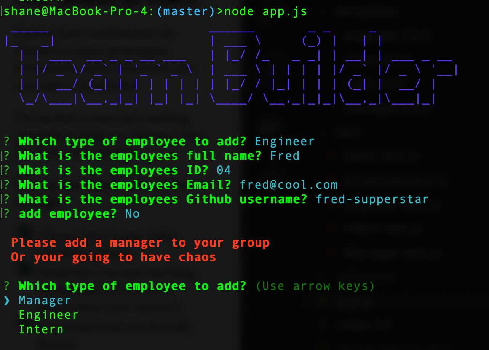
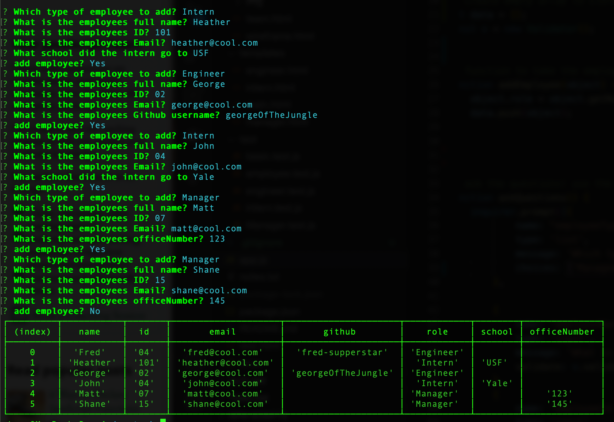

    
 
# Project name : TEAM-GENERATOR

[hw10-Template-Engine](https://github.com/trilambda122/hw10-Template-Engine)
---
## Table of Contents

[Description](#description)...

[Installation Requirements](#installtion-requirments)...

[Useage](#useage)...

[License](#License)...

[Contribitors](#Contribitors)...

[Tests](#Tests)...

[Questions](#Questions)...

[Application Screen Shots](#ScreenShots)...

---
## Description
This appilcation will create a team roaster from the user provided input done at the CLI

The application will perform basic numeric and email validation thorugh a provided validation class

The application will verify that each team has at least one manager

This applicaiton has a full suite of test provided

---

## Installtion requirments
npm install

---
## Useage
Each team must have at least one manager

---
## License
NOTICE This application is covered under MIT License license.
Please see license.md file for more information 

---
## Contribitors 

trilambda122

---
## Tests
full test suite provided

---
## Questions

Github profile can be found here:  http://github.com/trilambda122

Please direct any additonal questions to: trilambda122@gmail.com

---
## ScreenShots

*SCREEN SHOT 1*
*SCREEN SHOT 2*

